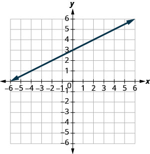

- Recognize the relation between the graph and the slope–intercept form of an equation of a line
- Identify the slope and y-intercept form of an equation of a line
- Graph a line using its slope and intercept
- Choose the most convenient method to graph a line
- Graph and interpret applications of slope–intercept
- Use slopes to identify parallel lines
- Use slopes to identify perpendicular lines

## Assignment

- [#289–381 1-5-9s](https://openstax.org/books/elementary-algebra-2e/pages/4-5-use-the-slope-intercept-form-of-an-equation-of-a-line#fs-id1169594078632)

---

## Slope-Intercept Form and Graphs

Linear equations are often written in terms of $x$, meaning they start as $y=$, and then the rest of the equation is on the other side. For example, the equation ${y=\frac{1}{2}x+3}$. This equation has two terms in it: $\frac{1}{2}x$ and $3$. Each has an effect on the final graph, and we'll look at both of them.

First up is our constant, $3$. No matter what, a $3$ will always be added as the last step in determining your $y$-value. This also means that when the rest of the equation is $0$, which happens when $x=0$, the result will be $3$. Well, $y$-intercepts are when $x=0$, so that means $3$ is where our graph will cross the $y$-axis.

The other term is $\frac{1}{2}x$. This is a little tougher to read at first, but if we make a table of $x$-values, its effect becomes clearer.

|  $x$  | $\frac{1}{2}x$ |
| :---: | :------------: |
|  $0$  |      $0$       |
|  $1$  | $\frac{1}{2}$  |
|  $2$  |      $1$       |
|  $3$  | $\frac{3}{2}$  |
|  $4$  |      $2$       |

Every time $x$ increases by $1$, the result increases by $\frac{1}{2}$. Well, that's just slope. Our rise goes up by $\frac{1}{2}$ as the run increases by $1$.

This means our equation ${y=\frac{1}{2}x+3}$ tells us two things about the line, without needing to graph it: the slope and the $y$-intercept. Slope tells you the angle of the line, and the intercept where the line is on the coordinate plane. That's enough to graph it without making a table.

> 
>
> **Figure 4.5.4** The graph of ${y=\frac{1}{2}x+3}$.
{: .figure}

What we did above extends to *all* linear equations, but they have to be written the same way.

> ### Slope-Intercept Form
>
> The slope–intercept form of a line with slope $m$ and $y$-intercept $(0,b)$ is
>
> $$\begin{align}
> y=mx+b
> \end{align}$$
{: .definition}

So, the line with an equation of $y=2x - 1$ has a slope of $2$ and a $y$-intercept of $-1$. You can check that for yourself on a graphing calculator, like [Desmos](https://www.desmos.com/calculator).

## Parallel and Perpendicular Lines

A bit of a tangent here, but parallel lines are lines that never cross. Since we are talking about slope now, we add to that definition. Parallel lines also have the same slope.

Perpendicular lines are lines that form a right-angle when they intersect. Turns out their slopes are related as well: each is a negative reciprocal of the other.

> ### Perpendicular Lines
>
> Perpendicular lines are lines in the same plane that form a right angle.
>
> If $m_1$ and $m_2$ are the slopes of two perpendicular lines, then
>
> $$\begin{align}
> m_1 = -\frac{1}{m_2}
> \end{align}$$
{: .definition}

That might look complicated, but just take the one slope, flip it upside down and switch the sign. If a line has a slope of $\frac{2}{3}$, then the perpendicular line has a slope of $-\frac{3}{2}$. If the slope is $-5$, the perpendicular one is $\frac{1}{5}$.
