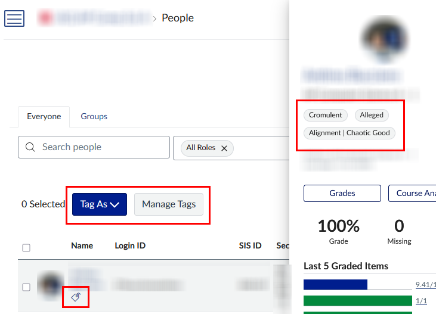

[Link to Canvas’s guide on the topic](https://community.canvaslms.com/t5/Instructor-Guide/How-do-I-create-and-manage-Differentiation-Tags-as-an-instructor/ta-p/648065)

These allow you to group or highlight students in a way that only you can see. You can use tags when assigning items, as well as filter your gradebook with them.

The set-up for Differentiation Tags is under People in any of your courses. You can create single tags and tag sets, where the latter is a group of tags where you can select one for each student.

