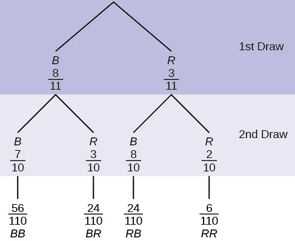
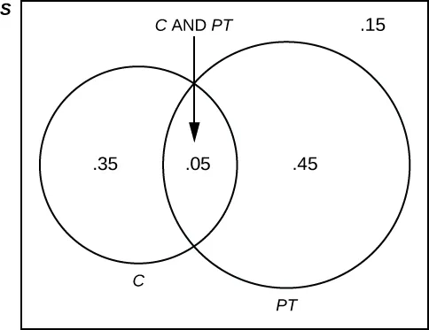

## Chapter Objectives

- Understand and use the terminology of probability
- Determine whether two events are mutually exclusive and whether two events are independent
- Calculate probabilities using the addition rules and multiplication rules
- Construct and interpret contingency tables
- Construct and interpret Venn diagrams
- Construct and interpret tree diagrams

## Assignment

- All **vocabulary** (see [Key Terms](https://openstax.org/books/statistics/pages/3-key-terms) for definitions)
- [3.5 Homework](https://openstax.org/books/statistics/pages/3-homework#fs-idp43118896){: target="_blank"} 113–115
  - [Solutions](https://manville.instructure.com/courses/5045/files?preview=811475){: target="_blank"}
- Read the next section in the book

---

Like [last section](./3-4-contingency-tables.md), there really isn't new material, just working with a different view of probability. This time, using tree diagrams and Venn diagrams to visualize a situation. Tree diagrams use a branching graph to show the outcome of multiple, while Venn diagrams show the relationship between outcomes of an experiment using overlapping circles or ovals.

> 
>
> **Figure 3.5.1** A tree diagram showing the probability of drawing blue and red marbles from a bag without replacement.
{: .figure}

> 
>
> **Figure 3.5.2** A Venn diagram showing that $40\%$ of students belong to a club of the time,  $50\%$ work part-time, while $5\%$ both belong to a club and work part-time.
{: .figure}

