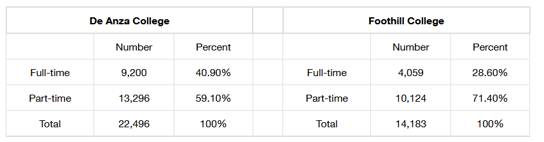
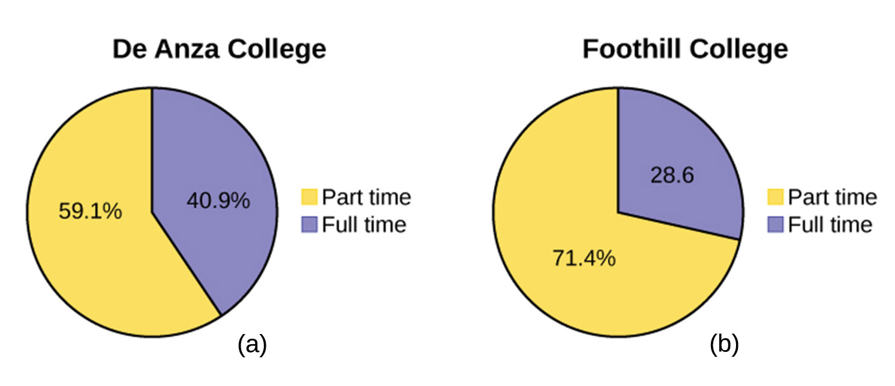
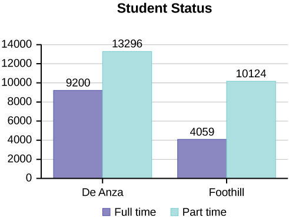
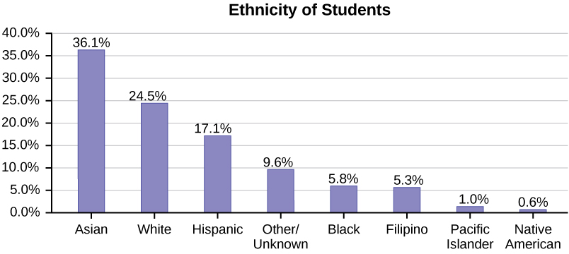
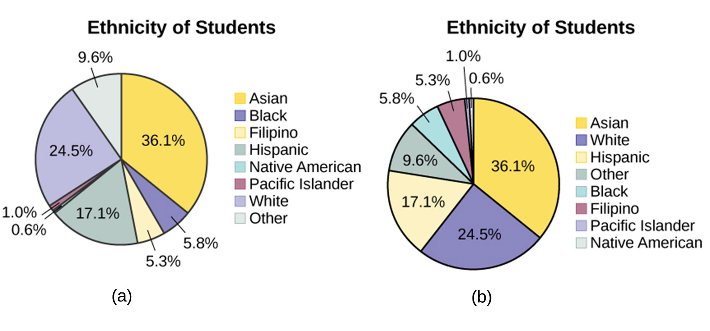
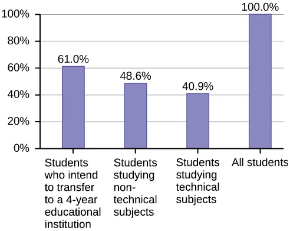
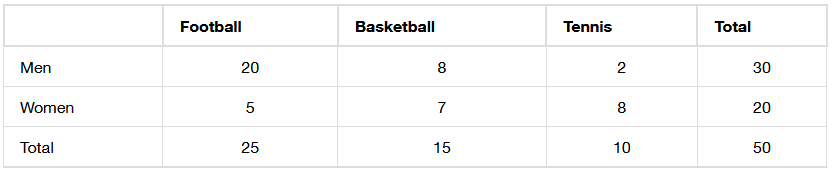

## Chapter Objectives

- Recognize and differentiate between key terms.
- Apply various types of sampling methods to data collection.
- Create and interpret frequency tables.

## Assignment

- All **vocabulary** (see [Key Terms](https://openstax.org/books/statistics/pages/1-key-terms){: target="_blank"} for definitions)
- [1.2 Homework](https://openstax.org/books/statistics/pages/1-homework#fs-idm36629824){: target="_blank"} 57–83 odds
  - [Solutions](https://manville.instructure.com/courses/5660/files?preview=780645){: target="_blank"}
- Read the next section in the book

---

- {: .document}[PowerPoint version](https://1drv.ms/p/c/c4097c61e06a2b97/ER72JSzD9yVDiMuNKnzjyVsBdlqBVdMzuxyojYYnfszs7w?e=L1e7tJ){: target="_blank"}
{: .icon-list}

## Qualitative Data

- Also known as **categorical** data
- Describes attributes
- e.g., hair color, blood type, place of birth
- Easy to work since there's less math involved

## Quantitative Data

- Numbers!
- e.g., money, pulse, height
- Discrete quantitative data means only certain numbers, typically whole numbers
- e.g., number of people in a household
- Continuous quantitative data is data where all numbers in a range are valid
- e.g., height, weight, time
- **! Limited accuracy doesn't imply discrete !**

## Discrete or Continuous?

- Number of classes in a schedule?
- Square footage of a room?
- Minutes spent at practice?
- Ask if you are counting or measuring.

## Displaying Qualitative Data: Tables

> 
>
> **Figure 1.2.1** A table comparing part-time and full-time students at two colleges.
>
{: .figure}

- Helpful for organization
- Poor for understanding
- Including percentages is good for comparing data sets of different sizes

## Displaying Qualitative Data: Pie Chart

> 
>
> **Figure 1.2.2** A pie chart representing the same data from above.
{: .figure}

- Wedges represent each category
- Should only be used when percentages add up to 100%
- Best for showing portion of the whole

## Displaying Qualitative Data: Bar Graph

> 
>
> **Figure 1.2.3** A bar chart, also showing the same data as above.
{: .figure}

- Good for change over time or comparisons
- Preferable to pie charts if there are many categories

> 
>
> 
>
> **Figure 1-2-4** Ethnicity of students at a college. The large number of categories make it tougher to see comparisons in a pie chart. Ordering from largest to smallest in both improves readability. When bar charts are ordered this way, they are called **Pareto charts**.
{: .figure}

> 
>
> **Figure 1.2.5** When subjects overlap categories, percentages add up to over 100%. Including a population bar helps with making it clear that there is overlap.
{: .figure}

## Two-Way Tables

> 
>
> **Figure 1.2.6** A two-way table for men and women's sports preference.
{: .figure}

- Two categories means two-way
- Marginal distributions are the totals (on the margins/edges)
- Conditional distribution involve specific subsets
- E.g., men who prefer basketball, which is 8
- Inner vs outer part of the table
- What percentage of men prefer basketball?
- What percentage of basketball fans are men?
- “Of” signifies the total you should be looking at

## Sampling

- Population too big? Just get some of them, randomly.
- Simple random: everyone has equal chance of being picked
- Stratified sample: group by a characteristic, then randomly
- Cluster sample: break population into groups that mirror the population, then sample random clusters
- Systemic sample: sample every 𝑛th subject
- ~~Convenience sampling: just getting whoever is available~~
- Avoid bias by keeping your population in mind

## Critical Evaluation of Your Study

- Problems with samples?
- Self-selected samples?
- Sample size issues?
- Undue influence?
- Non-response?
- Causality?
- Self-funded study?
- Misleading use of data?
