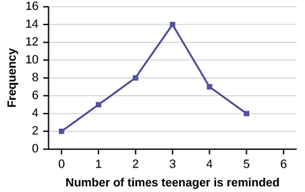
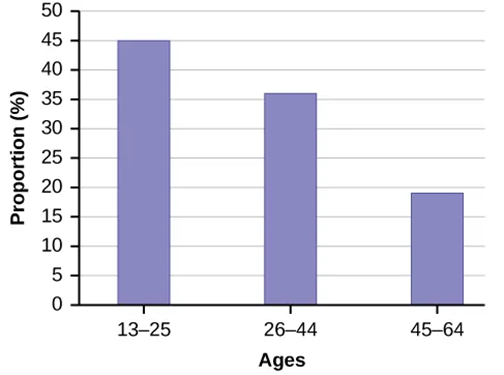

## Chapter Objectives

- Display data graphically and interpret the following graphs: stem-and-leaf plots, line graphs, bar graphs, frequency polygons, time series graphs, histograms, box plots, and dot plots
- Recognize, describe, and calculate the measures of location of data with quartiles and percentiles
- Recognize, describe, and calculate the measures of the center of data with mean, median, and mode
- Recognize, describe, and calculate the measures of the spread of data with variance, standard deviation, and range

## Assignment

- All **vocabulary** (see [Key Terms](https://openstax.org/books/statistics/pages/2-key-terms){: target="_blank"} for definitions)
- [2.1 Homework](https://openstax.org/books/statistics/pages/2-homework#fs-idp103158432){: target="_blank"} 78–79
  - [Solutions](https://manville.instructure.com/courses/5660/files?preview=780645){: target="_blank"}
- Read the next section in the book

---

- {: .document}[PowerPoint version](https://1drv.ms/p/c/c4097c61e06a2b97/Ef6_N0lMqdxOm_tTAMaPEy0BR6uvfkQFZB9phqWePxS4HQ?e=5JZ54o){: target="_blank"}
{: .icon-list}

## The Stem-and-Leaf Graph

- Good for small data sets
- Shape provides info on the distribution
- Can reveal outliers
- Leaf is the final significant digit
- Stem are the leading digits
- Stem on left of a vertical line
- Leaves on the right

> {: width="300"}
>
> **Figure 2.1.1** A stem and leaf plot.
{: .figure}

## Line Graphs and Bar Graphs

- Good for representing frequency tables
- Points are plotted at frequency, then connected by lines
- Bars are the height of the frequency with space between

> {: width="300"}
>
> **Figure 2.1.2** A line graph.
{: .figure}

> {: width="300"}
>
> **Figure 2.1.3** A bar graph.
{: .figure}
