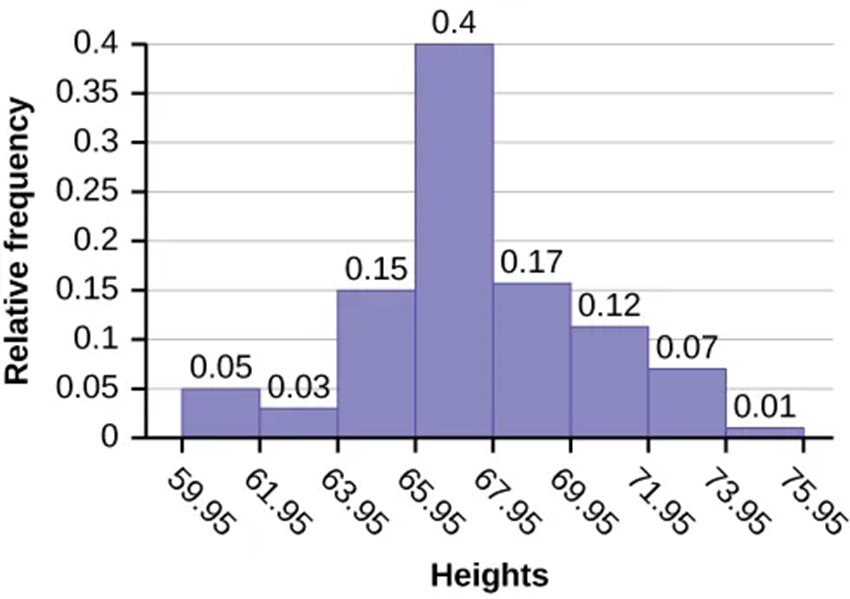
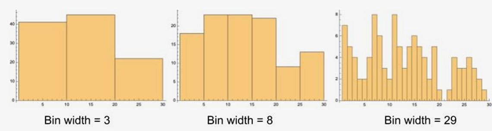
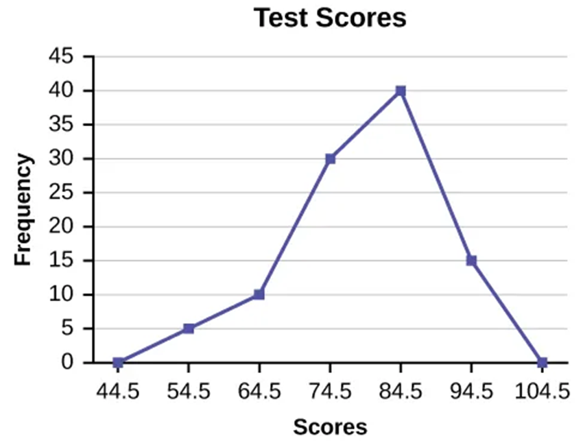
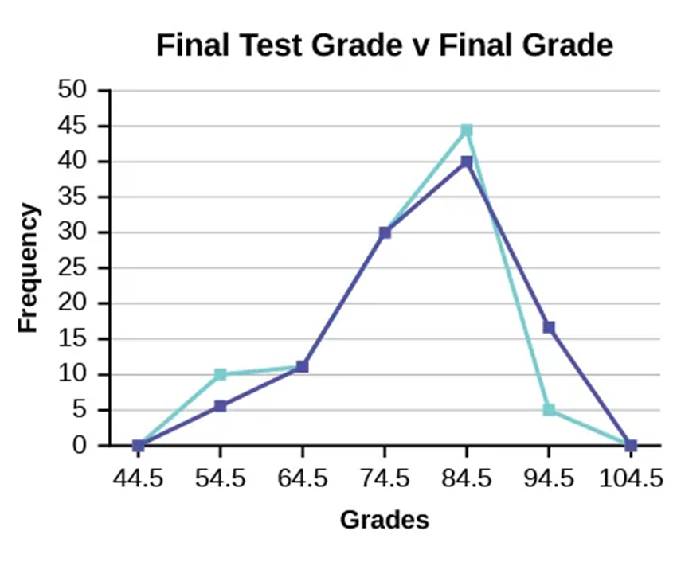
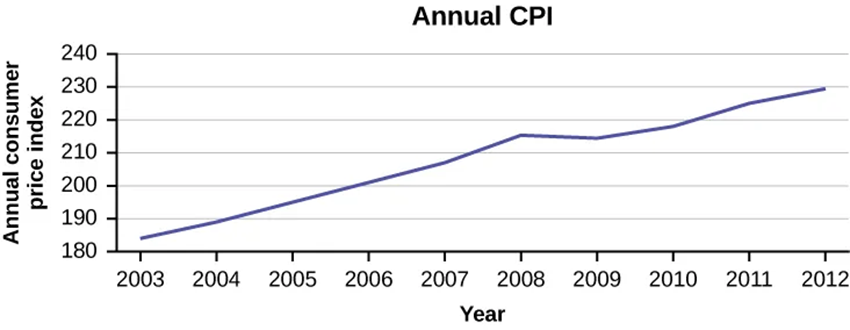

## Chapter Objectives

- Display data graphically and interpret the following graphs: stem-and-leaf plots, line graphs, bar graphs, frequency polygons, time series graphs, histograms, box plots, and dot plots
- Recognize, describe, and calculate the measures of location of data with quartiles and percentiles
- Recognize, describe, and calculate the measures of the center of data with mean, median, and mode
- Recognize, describe, and calculate the measures of the spread of data with variance, standard deviation, and range

## Assignment

- All **vocabulary** (see [Key Terms](https://openstax.org/books/statistics/pages/2-key-terms){: target="_blank"} for definitions)
- [2.2 Homework](https://openstax.org/books/statistics/pages/2-homework#fs-idp52790224){: target="_blank"} 80–85
  - [Solutions](https://manville.instructure.com/courses/5045/files?preview=811475){: target="_blank"}
- Read the next section in the book

---

- {: .document}[PowerPoint version](https://1drv.ms/p/c/c4097c61e06a2b97/Ef6_N0lMqdxOm_tTAMaPEy0BR6uvfkQFZB9phqWePxS4HQ?e=5JZ54o){: target="_blank"}
{: .icon-list}

## Histograms

- Not a bar graph
- Typically used for continuous data
- Bars are next to each other to highlight the continuity
- Vertical can show frequency or relative frequency (percentage of total data)

> {: width="300"}
>
> **Figure 2.2.1** A histogram.
{: .figure}

### Creating Histograms

> {: width="500"}
>
> **Figure 2.2.2** The three histograms above are created using the same data sets, but with different bin widths.
{: .figure}

- Number of bins is key
- If not given, square root the number of data points and round up to next integer. Then divide range of data by that integer.
  - Round up again, this time to same number of digits as data
- Ex. There are 100 data points. The lowest value is 60.0, highest 74.0. What is the bin width? What if it was 80 with the same range?
- Below are the bin widths for 10 bins

$$\begin{align*}
&[60, 61.4]    &&(61.4, 62.8]  &&(62.8, 64.2]  &&(64.2, 65.6] \\
&(65.6, 67]    &&(67, 68.4]    &&(68.4, 69.8]  &&(69.8, 71.2] \\
&(71.2, 72.6]  &&(72.6, 74] && &&
\end{align*}$$

- Square bracket means included
- Parentheses mean up to, but not including
- A value of 61.4 falls in the first bin

## Frequency Polygons

- A histogram pretending to be a line graph
- Same rules from histograms
- Points are at midpoint of bin
- Useful for comparisons since they overlap easily

> {: width="300"}
>
> **Figure 2.2.3** A frequency polygon.
{: .figure}

> {: width="300"}
>
> **Figure 2.2.4** Two frequency polygons overlapping.
{: .figure}

## Time Series Graph

- Used for plotting data that changes over time
- Points are in chronological order

> {: width="500"}
>
> **Figure 2.2.5** A time series graph.
{: .figure}
