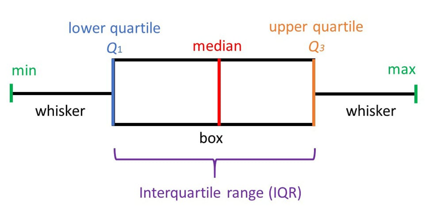

## Chapter Objectives

- Display data graphically and interpret the following graphs: stem-and-leaf plots, line graphs, bar graphs, frequency polygons, time series graphs, histograms, box plots, and dot plots
- Recognize, describe, and calculate the measures of location of data with quartiles and percentiles
- Recognize, describe, and calculate the measures of the center of data with mean, median, and mode
- Recognize, describe, and calculate the measures of the spread of data with variance, standard deviation, and range

## Assignment

- All **vocabulary** (see [Key Terms](https://openstax.org/books/statistics/pages/2-key-terms){: target="_blank"} for definitions)
- [2.4 Homework](https://openstax.org/books/statistics/pages/2-homework#fs-idp27456352){: target="_blank"} 90–94
  - [Solutions](https://manville.instructure.com/courses/5045/files?preview=811475){: target="_blank"}
- Read the next section in the book

---

- {: .document}[PowerPoint version](https://1drv.ms/p/c/c4097c61e06a2b97/ERwZD5B5NupGriTdMvcsPksBQwHe6V2X9kkGukHDLoR7RQ?e=MajMwc){: target="_blank"}
{: .icon-list}

## Box Plots

- Uses positional measurements to show concentration of data
- Min, max, median, $𝑄_1$ and $𝑄_3$
- The middle 50% is the box
- Whiskers go out to the min and max
- Median is drawn inside the box

> {: width="400"}
>
> **Figure 2.4.1** A box plot.
{: .figure}

## Drawing a Box Plot

- Start with a properly scaled number line
- Draw vertical lines at $𝑄_1$ and $𝑄_3$. Lines should be the same length
- Create a box from those two lines
- Draw the median inside the box
- Mark the minimum and maximum
- Draw whiskers to them from the box
