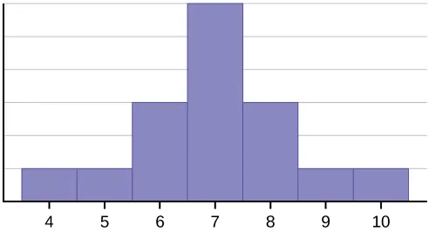
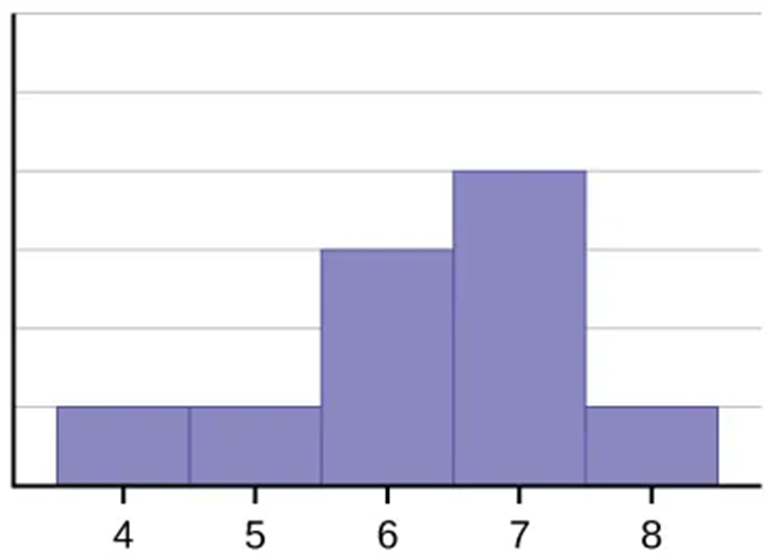
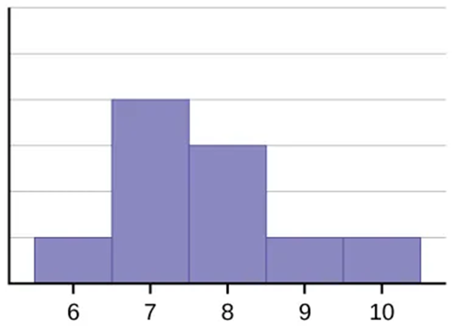
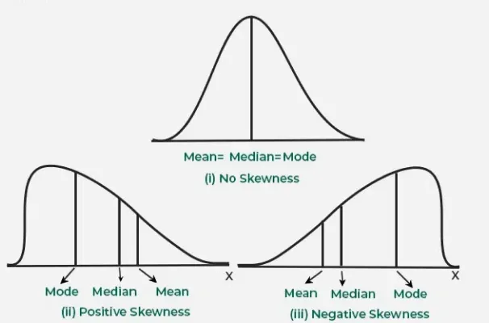

## Chapter Objectives

- Display data graphically and interpret the following graphs: stem-and-leaf plots, line graphs, bar graphs, frequency polygons, time series graphs, histograms, box plots, and dot plots
- Recognize, describe, and calculate the measures of location of data with quartiles and percentiles
- Recognize, describe, and calculate the measures of the center of data with mean, median, and mode
- Recognize, describe, and calculate the measures of the spread of data with variance, standard deviation, and range

## Assignment

- All **vocabulary** (see [Key Terms](https://openstax.org/books/statistics/pages/2-key-terms){: target="_blank"} for definitions)
- [2.6 Homework](https://openstax.org/books/statistics/pages/2-homework#fs-idm100553376){: target="_blank"} 97
  - [Solutions](https://manville.instructure.com/courses/5045/files?preview=811475){: target="_blank"}
- Read the next section in the book

---

- {: .document}[PowerPoint version](https://1drv.ms/p/c/c4097c61e06a2b97/EQk394y1aURJhezsLSb7MxUBitoBvEQoWSrhnBig5-uwpg?e=JcYCPB){: target="_blank"}
{: .icon-list}

## Symmetrical vs Skewed

> {: width="300"}
>
> **Figure 2.6.1** A symmetrical distribution.
{: .figure}

- In a symmetrical distribution, the left side is a mirror image of the right side
- Mean and the median are the same
- Skewed data is where the bulk of the data is off to the side

> {: width="300"}
>
> **Figure 2.6.2** A left skewed, or negative skewed, distribution.
{: .figure}

> {: width="300"}
>
> **Figure 2.6.2** A right skewed, or positive skewed, distribution.
{: .figure}

- Name is based on where the tail is
- A negative skew has a long tail on the left, or the negative side of the number line
- Positive skew has the tail on the right
- The tail drags the mean to that side, far more than the median

> 
>
> **Figure 2.6.3** A comparison of how skew affects the different averages.
{: .figure}
