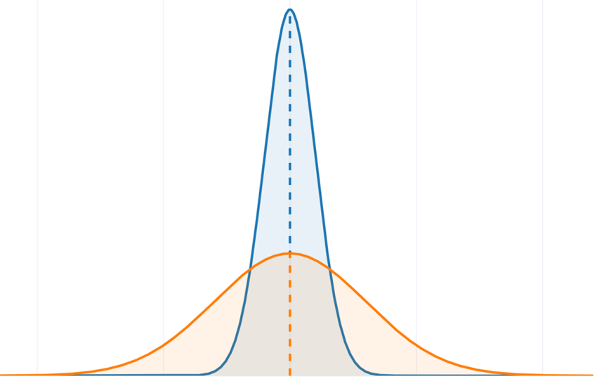
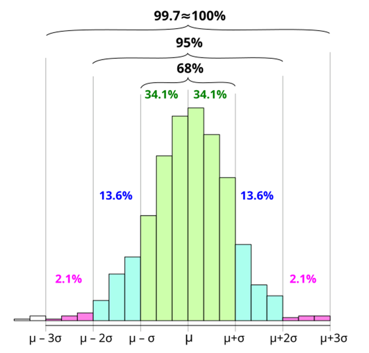

## Chapter Objectives

- Display data graphically and interpret the following graphs: stem-and-leaf plots, line graphs, bar graphs, frequency polygons, time series graphs, histograms, box plots, and dot plots
- Recognize, describe, and calculate the measures of location of data with quartiles and percentiles
- Recognize, describe, and calculate the measures of the center of data with mean, median, and mode
- Recognize, describe, and calculate the measures of the spread of data with variance, standard deviation, and range

## Assignment

- All **vocabulary** (see [Key Terms](https://openstax.org/books/statistics/pages/2-key-terms){: target="_blank"} for definitions)
- [2.7 Homework](https://openstax.org/books/statistics/pages/2-homework#fs-idm25848496){: target="_blank"} 98–111
  - [Solutions](https://manville.instructure.com/courses/5045/files?preview=811475){: target="_blank"}
- Read the next section in the book

---

- {: .document}[PowerPoint version](https://1drv.ms/p/c/c4097c61e06a2b97/EfRCf-7RTjhEl4qJ-mzxPsUBYsu3KQjScI4ARwkGXnPQKQ?e=6SWCQZ){: target="_blank"}
{: .icon-list}

## Data Spread

- Mean can tell you where the data is
- Spread can tell you how concentrated it is at the center
- **Standard deviation** measures the spread of data from the mean
- This spread is also called **variation**

> {: width="300"}
>
> **Figure 2.7.1** The orange distribution has a much higher variance than the blue distribution.
{: .figure}

## Standard Deviation as a Ruler

- A set of data has a mean of 80 and a standard deviation of 5
- A value of 85 is one standard deviation above the mean. 75 is one below. 90 would be two standard deviations.
- How many is 88?

> ### _Z_-scores
>
> Where $x$ is the value, $\mu$ the mean, and $\sigma$ the standard deviation,
>
> $$\begin{align}
> z &= \frac{x - \mu}{\sigma}
> \end{align}$$
{: .definition}

- Z-scores tell you how many standard deviations a data point is from the mean
- Positive is above, negative below
- 88 has a z-score of $(88−80)/5=1.6$, so 1.6 standard deviations above the mean
- 67 has a z-score of $(67−80)/5=−2.6$, or 2.6 standard deviations below the mean

## The Empirical Rule (68-95-99.7 Rule)

- A normal distribution where the bulk of the data is in the middle
  - 68% of the data falls within one standard deviation
  - 95% falls within two
  - 99.7% falls within three

> {: width="300"}
>
> **Figure 2.7.2** A visual representation of the Empirical Rule.
{: .figure}

## Calculating Standard Deviation

> ### Standard Deviation
>
> Where $x$ represent each data value, $\mu$ the mean, and $n$ the total number of values,
>
> $$\begin{align}
> \sigma &= \sqrt{\frac{\sum (x - \mu)^2}{n}}
> \end{align}$$
>
> In other words,
>
> 1. Find the differences between each data point and the mean
> 2. Square each one
> 3. Add them all up
> 4. Divide by the number of data points
> 5. Square root that quotient
{: .definition}

## Standard Deviation vs IQR

- Mean and standard deviation are related
- Median and IQR are also related
- First measures the center, second the spread
- Mean and standard deviation are influenced by the magnitude
- Median and IQR care only about position
