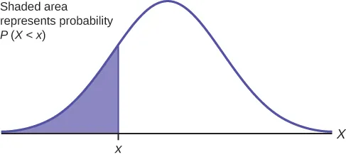
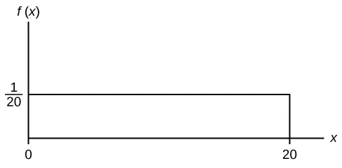
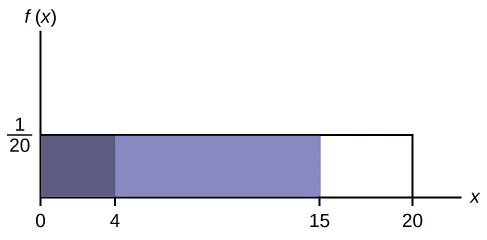

## Chapter Objectives

- Recognize and understand continuous probability density functions in general
- Recognize the uniform probability distribution and apply it appropriately
- Recognize the exponential probability distribution and apply it appropriately

## Assignment

- All **vocabulary** (see [Key Terms](https://openstax.org/books/statistics/pages/1-key-terms) for definitions)
- [5.1 Homework](https://openstax.org/books/statistics/pages/5-homework){: target="_blank"} 72–73
  - [Solutions](https://manville.instructure.com/courses/5660/files?preview=780645){: target="_blank"}
- [Khan Academy: Probability in density curves](https://www.khanacademy.org/math/statistics-probability/random-variables-stats-library/random-variables-continuous/e/probability-density-curves){: target="blank"}
- Read the next section in the book

---

With discrete probability functions, calculating probability involved basic counting and dividing. This won't work with continuous probability functions because you can't count something that is uncountable. (Can you count all the numbers that fall between $0$ and $1$?).

Because of this, continuous probability functions are represented with shapes and curves. And with that, probability is calculated by finding area.

> 
> 
> **Figure 5.1.1** A continuous probability distribution. The probability that a random point will be in the shaded area is equal to the area of the shape that is shaded.
{: .figure}

When dealing with continuous functions, probability statements typically look at ranges of a values. Visually, this looks like shading in a portion of the function's "shape". Finding the area of the shaded portion and comparing it to the total area will give you the probability.

## Example

> Given the continuous probability function below, find the following.
>
> 1. $P(x < 10)$
> 1. $P(x > 6)$
> 2. $P( 4 < x < 15 )$
>
> > 
> >
> > **Figure 5.1.2** Continuous distribution with $x$ values ranging from $0$ to $20$. It has a uniform probability of $1/20$.
> {: .figure}
{: .example}

Before getting to each, let's find the total area.

$$ \frac{1}{20} \cdot 20 = 1$$

This means all the areas we find below will also be the probability without any extra calculations.

1. With $x<10$, that means we are looking at an area starting at $0$ and going all the way to $10$. That area is $10 \cdot \frac{1}{20}=\frac{1}{2}$.

2. The area here goes from $6$ to $20$, and some subtraction tells us that distance is $14$. Our area, and probability, is $14 \cdot \frac{1}{20}=\frac{7}{10}$.

3. We can do something similar here and subtract to get a distance of $11$, but a trick that will be helpful later is subtracting areas.

    > 
    >
    > **Figure 5.1.3** Finding the larger area and subtracting the smaller one will be helpful with more complicated areas, like in Figure 5.1.1.
    {: .figure}
  
    The area from $0$ to $15$ is $15\cdot\frac{1}{20}=\frac{3}{4}$, and the are from $0$ to $4$ is $4\cdot\frac{1}{20}=\frac{1}{5}$. Decimals are easier here, so $0.75-0.2=0.55$.

    Yes, this is identical just using the width, and more work, but remember that this will be useful later.
  
$\blacksquare$
{: .qed}
