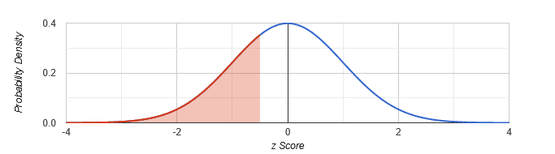

## Chapter Objectives

- Recognize the normal probability distribution and apply it appropriately
- Recognize the standard normal probability distribution and apply it appropriately
- Compare normal probabilities by converting to the standard normal distribution

## Assignment

- All six TRY IT problems in [6.1 The Standard Normal Distribution](https://openstax.org/books/statistics/pages/6-1-the-standard-normal-distribution)
- [6.1 Homework](https://openstax.org/books/statistics/pages/6-homework#fs-idm58670224){: target="_blank"} 60–67
  - [Solutions](https://manville.instructure.com/courses/5660/files?preview=780645){: target="_blank"}
- Read the next section in the book

---

## The Normal Distribution

Last chapter, we looked at uniform distributions whose shape was a rectangle. They looked this way because each event had an equal chance of happening. One example would be birthdays, which isn't perfectly uniform, but fairly close.

For events that don't have an equally likely chance, we have to look towards other distributions for modeling and analysis. One of those is the normal distribution.

> {: width="400"}
>
> **Figure 6.1.1** The normal distribution, which is shaped like a bell and often referred to as a bell curve.
{: .figure}

The events most likely to happen are bunched towards the middle, while the less likely events are near the extremes. A person's height can be modeled with the normal distribution. Most people fall somewhere in the middle, with few people being very tall or very short.

## The Standard Normal Distribution

The standard normal distribution is an idealized version of the normal distribution. It has a mean of 0 and a standard deviation of 1. This "ideal" curve is helpful for analysis and comparisons, and more specifically, is used to generate areas above and below _z_-scores, or standard deviations.

> 
>
> **Figure 6.1.2**  A normal distribution with a _z_-score and the area below it shaded. 
{: .figure}

## Calculating _z_-scores

A _z_-score represents how many standard deviations a value is from the mean, we calculate it them with this formula.

$$\begin{align}
z &= \frac{x - \mu}{\sigma}
\end{align}$$

The numerator gives you the raw distance from the mean to the value. Then, dividing by the standard deviation tells how many standard deviations away it is, which is the _z_-score.

> It's a bit like measuring the distance to an object, and then dividing by 12 to get how many feet away it is.

Our equation has four variables, so assuming we have three of those pieces, we can always find the fourth with a little algebra.

> ## Example 1
>
> Suppose $X \sim N(5,6)$. Find the _z_-score when $x=17$.
{: .example}

The first part, $X \sim N(5,6)$, tells us we have a normal distribution with a mean of 5 and a standard deviation of 6. That means our equation will look like this.

$$\begin{align}
z &= \frac{x-\mu}{\sigma} \\[0.5em]
  &= \frac{17-5}{6} \\[0.5em]
  &= 2
\end{align}$$

$\blacksquare$
{: .qed}

## The Empirical Rule

Using _z_scores to find area, and therefore probability, will come a bit later. For the moment we'll focus on a rule of thumb that's helpful for estimation.

In a normal distribution, about 68% of the data falls within one standard deviation of the mean. About 95% falls within two standard deviations, and about 99.7% falls within three.

> 
>
> **Figure 6.1.2** The empirical rule, also known as the 68-95-99.7 rule.
{: .figure}

> ## Example 2
>
> With the same distribution from before, $X \sim N(5,6)$, what two values do 68% of the data lie?
{: .example}

Since 68% falls between one standard deviation, we need to find out what values are one standard deviation above and below the mean.

Since our mean is 5 and standard deviation is 6, we can calculate our bounds by adding and subtracting 6 to 5. So, 68% of our data falls between −+1 and 11.

$\blacksquare$
{: .qed}
