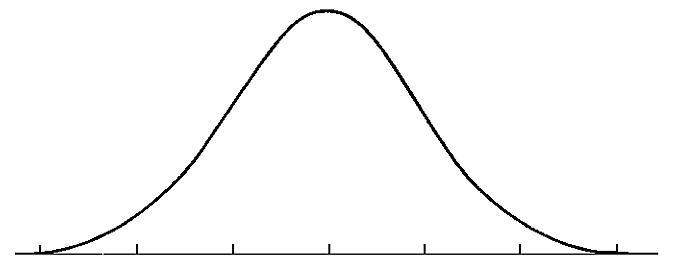

## Chapter Objectives

- Recognize central limit theorem problems
- Classify continuous word problems by their distributions
- Apply and interpret the central limit theorem for means
- Apply and interpret the central limit theorem for sums

## Assignment

- All **vocabulary** (see [Key Terms](https://openstax.org/books/statistics/pages/1-key-terms) for definitions)
- [7.1 Homework](https://openstax.org/books/statistics/pages/7-homework#fs-idp66376176){: target="_blank"} 61–71
  - [Solutions](https://manville.instructure.com/courses/5660/files?preview=780645){: target="_blank"}
- Read the next section in the book

---

## A Normal Refresher

A distribution shows to the probability of a particular value appearing if chosen at random. A normal distribution is a symmetrical distribution with the bulk of the data falling in the middle. It's also called the bell curve since its shape resembles a bell.

> 
>
> **Figure 7.1.1** A normal distribution.
{: .figure}

This distribution appears naturally in many areas, like human height, but combine that with its symmetrical nature and you have a useful tool for analyzing data.

## Normal Means

There are certain variables that just don't have a normal distribution, one being retirement age which has a negative skew (long tail on the left).

> 
>
> **Figure 7.1.2** A negative skew, which has a long tail on the left (negative) part of the axis.
{: .figure}

But that not-normal distribution only applies to the individual data points. If we were to go around and collect samples of retirement ages, the means of those samples would produce a normal distribution. No skew. No irregularities. And the larger the sample size, the more it would resemble a normal distribution.

This is tough to visualize, so I recommend using [this tool from Rice University](https://onlinestatbook.com/stat_sim/sampling_dist/){: target="_blank"}. Create a distribution, and make it as strange as possible. Then produce samples and watch how the mean of those samples produces a normal distribution.

This means analyzing data, especially those with irregular or even unknown distributions can be simplified. Of course, this only works if we are concerned about the mean of the group.

## A New Z-Score

This does have an effect on how _z_-scores are calculated. The mean is still the mean, but the standard deviation is not referred to as the **standard error**. This is calculate by taking the standard deviation and dividing by the square root of the sample size.

> ### _Z_-score for Central Limit Theorem
>
> $$\begin{align}
> z = \frac{\bar{x}-\mu}{\frac{\sigma}{\sqrt{n}}}
> \end{align}$$
{: .definition}

After that, you use your table like normal to find the associated area.
